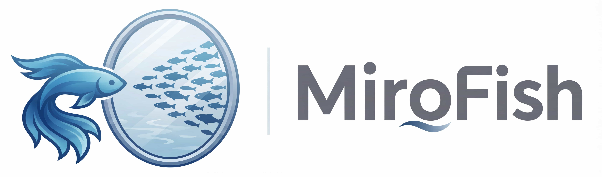

<div align="center">



简洁通用的群体智能引擎，预测万物 —— 可直接使用 DeepSeek API 运行
</br>
<em>A Simple and Universal Swarm Intelligence Engine, Predicting Anything</em>

[English](./README.md) | [中文文档](./README-ZH.md)

</div>

---

## ✨ 这个 fork 带来了什么

### 一、直连 DeepSeek API —— 不再依赖 Zep Cloud 与外部图数据库

知识图谱原本依赖 Zep Cloud：第二个供应商、第二个 API Key，而且那个 Key 一旦缺失就
**直接起不来**。现在完全本地化：

- 抽取由 **DeepSeek**（`deepseek-chat`）通过标准 OpenAI 兼容接口完成
- 图谱存储是**本地 SQLite 文件**（`backend/uploads/graphs.db`）
- **不再需要 `ZEP_API_KEY`**，它也已从启动校验中移除
- 任何 OpenAI 兼容接口都能换，改 `LLM_BASE_URL` / `LLM_MODEL_NAME` 即可

### 二、多格式文档摄入

种子材料不再限于 PDF / Markdown / TXT：

| 类别 | 格式 |
|---|---|
| 文档 | `.pdf`（文字层，扫描页可选 OCR）、`.docx`、`.pptx`、`.xlsx`、`.xlsm` |
| 文本 | `.txt`、`.md`、`.markdown`、`.csv` |
| 图片 | `.png`、`.jpg`、`.jpeg`、`.heic`、`.heif`、`.tiff`、`.tif`、`.bmp`、`.webp`、`.gif`（走 OCR） |

- OCR 使用 **macOS 本地 Vision 框架**，免费、离线、无需密钥（`uv sync --extra ocr-macos`），
  也可以改用视觉大模型接口
- 旧版 Office 二进制格式（`.doc` / `.ppt` / `.xls`）会被明确拒绝并提示「另存为 .docx/.pptx/.xlsx」，
  而不是静默失败
- 每个文件的解析结果都会回报，一个坏文件不再拖垮整批上传

### 三、开发亮点

这个 fork 从头到尾做过一轮审计，并围绕「可验证的行为」重建，而不是「看起来能跑」：

| 亮点 | 说明 |
|---|---|
| **图谱去重** | 节点身份从「每次抽取生成新 `uuid4()`」改为 `(graph_id, name)`。反复重建会把每个实体重新插入一遍——实测有个库**9336 行节点实际只有 960 个不同名字**（光 `SAP` 就有 440 份副本）。附迁移脚本 `scripts/dedupe_graph.py` 修复历史库，重建也不再累积 |
| **可离线验证** | `pytest` 从 **0 个测试变成 92 个**，另有回测框架（桩驱动、39 项检查）、多格式摄入检查（11 例）、前端 Markdown 检查（18 例）。全部**不需要联网，也不消耗任何 LLM 调用** |
| **成本护栏** | 人设生成与模拟启动前都会先预估 LLM 调用次数，超出设置的预算上限时停下来等确认，而不是默默发出成千上万次调用 |
| **可复现的运行** | 每份报告都带 run manifest（提交号、输入、模型），报告内含情景树而不只是单一叙述 |
| **健壮的模拟生命周期** | 卡住的模拟会被检测出来，不再永远停在 "running"；后端重启遗留的孤儿子进程会在启动时回收；主动停止不再被误报成失败 |
| **抗重启的任务跟踪** | 长任务落盘保存，跨后端重启存活，界面不会永远转圈 |
| **安全默认值** | 后端默认只绑 `127.0.0.1`，CORS 只放行本地开发源 |
| **输入处理加固** | 上传的切块参数会被校验（退化的 `chunk_overlap` 曾能把后台线程送进无界循环）；报告正文渲染前会做 HTML 转义 |

## 🏗 运行逻辑

```
文档 ─► 本体 ─► 知识图谱 ─► 人设 ─► 社会模拟 ─► 报告 ─► 对话
       (LLM)   (本地 SQLite)  (LLM)   (OASIS)    (LLM)
```

| 阶段 | 做什么 |
|---|---|
| 1. 本体生成 | DeepSeek 阅读种子材料，给出实体类型与关系类型 |
| 2. 图谱构建 | 文档切块后抽取实体与关系，结果写入 SQLite |
| 3. 人设生成 | 图谱中的每个实体变成一个带人设的 Agent |
| 4. 社会模拟 | Agent 在模拟的 Twitter / Reddit 上自主互动，行为作为时序记忆写回图谱 |
| 5. 报告生成 | Report Agent 从图谱检索并撰写分析报告，含情景树 |
| 6. 深度互动 | 与模拟世界中的任意个体对话，或与 Report Agent 对话 |

**进程模型：** Flask（端口 5001）提供 API，并把每一次模拟作为**独立子进程**托管；
前端是 Vite 应用（端口 3000）。运行中的事件注入与 Agent 访谈走基于文件的 IPC 通道
（`ipc_commands/` / `ipc_responses/`）。

**存储** —— 全部位于 `backend/uploads/`：

| 数据 | 位置 |
|---|---|
| 知识图谱 | `graphs.db`（SQLite） |
| 上传文件与项目 | `projects/` |
| 模拟运行 | `simulations/` |
| 报告 | `reports/` |
| 运行时设置（含你的 Key） | `macfish_settings.json`（已被 gitignore） |

## 🚀 快速开始

### 环境要求

| 工具 | 版本 | 检查 |
|---|---|---|
| **Node.js** | 18+ | `node -v` |
| **Python** | ≥3.11, ≤3.12 | `python --version` |
| **uv** | 最新版 | `uv --version` |

> 后端需要 Python ≥3.11。系统自带的 Python 太旧时，可以让 uv 代管：
> `uv python install 3.12`。

### 1. 配置环境变量

```bash
cp .env.example .env
# 然后编辑 .env，填入你的 DeepSeek Key
```

```env
LLM_PROVIDER=network
LLM_API_KEY=sk-your_deepseek_api_key
LLM_BASE_URL=https://api.deepseek.com
LLM_MODEL_NAME=deepseek-chat
```

> **不需要 Zep Cloud Key**，知识图谱是本地 SQLite。任何 OpenAI 兼容的供应商都可以，
> 改 `LLM_BASE_URL` / `LLM_MODEL_NAME` 指过去即可。

### 2. 安装依赖

```bash
npm run setup:all
```

也可以分步：`npm run setup`（Node）与 `npm run setup:backend`（Python）。

可选：图片与扫描版 PDF 的本地 OCR（仅 macOS）：

```bash
cd backend && uv sync --extra ocr-macos
```

### 3. 启动

```bash
npm run dev
```

- 前端：<http://localhost:3000>
- 后端 API：<http://localhost:5001>

单独启动：`npm run backend` / `npm run frontend`。

### Docker

```bash
cp .env.example .env
docker compose up -d
```

## 📖 使用说明

1. **创建项目** —— 打开 <http://localhost:3000>，上传种子文档（格式见上表）或粘贴文本，
   并描述你的预测需求。
2. **生成本体** —— DeepSeek 给出实体类型与关系类型，确认前可以自行调整。
3. **构建知识图谱** —— 文档切块后抽取进 `graphs.db`。重建会替换掉现有图谱，所以会先问一次。
4. **运行模拟** —— 由图谱实体生成人设，Agent 在模拟平台上自主互动，运行中可以注入事件。
5. **生成报告** —— Report Agent 撰写分析报告与情景树；之后可与任意 Agent 或 Report Agent 对话。

### 常见问题

| 现象 | 处理 |
|---|---|
| DeepSeek 额度用尽 | 把 `LLM_BASE_URL` / `LLM_MODEL_NAME` 指到别的 OpenAI 兼容供应商 |
| 抽取质量不理想 | 在本体生成阶段调整实体 / 关系类型 |
| 模拟太慢 | 调小 `.env` 里的 `OASIS_DEFAULT_MAX_ROUNDS`（默认 10） |
| 模拟卡在 "running" | 运行器现在会检测停滞，并在启动时回收孤儿进程 |
| 实体数看着被封顶了 | 超过读取上限的图谱会被截断，界面现在会明确提示 |
| 想重置图谱 | 用「删除并重建」，或直接删掉 `backend/uploads/graphs.db` |

## 🧪 测试

```bash
cd backend
uv run pytest tests -q                              # 92 项，离线
uv run python scripts/run_benchmark.py verify       # 39 项检查，桩驱动
uv run python scripts/test_multi_format.py          # 11 例格式
```

```bash
cd frontend
node scripts/check-markdown.mjs                     # 18 例
```

以上全部不需要联网，也不会消耗 LLM 调用。

## 📄 引用

Forked from **[MiroFish](https://github.com/666ghj/MiroFish)**。
